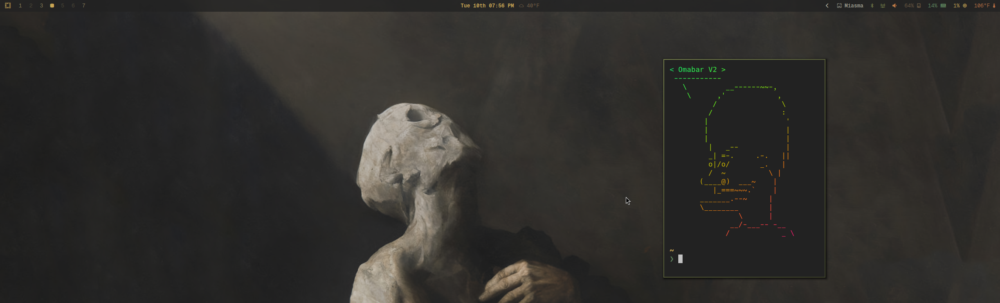

# jobo-bars

A personal collection of Waybar themes targeted at Omarchy.

## Required Dependency

These bars require the custom Omarchy templates from:

- https://github.com/OldJobobo/oldjobobo-custom-omarchy-templates

Without that templates repo, theme imports and palette-driven styling will not work correctly.

## Theme Index

| Theme | Preview | What It Feels Like | Paths |
|---|---|---|---|
| [omabar-v2](./omabar-v2/README.md) |  | A slim status bar with centered clock and media state, plus lightweight telemetry on the right. | `omabar-v2/config.jsonc` `omabar-v2/style.css` |
| [tilebar-v1](./tilebar-v1/README.md) |  | Structured, segmented tiles with strong module separation. | `tilebar-v1/config.jsonc` `tilebar-v1/style.css` |
| [pillbar-v1](./pillbar-v1/) | _No preview image in repo yet_ | Soft, rounded pill modules with compact visual rhythm. | `pillbar-v1/config.jsonc` `pillbar-v1/style.css` |

## Quick Open

- `omabar-v2`, `pillbar-v1`, and `tilebar-v1` use Omarchy's `colors.css` template (`../omarchy/current/theme/colors.css`) for dynamic palette-driven styling.
- Start with `omabar-v2/README.md` or `tilebar-v1/README.md` for theme-specific usage details.
