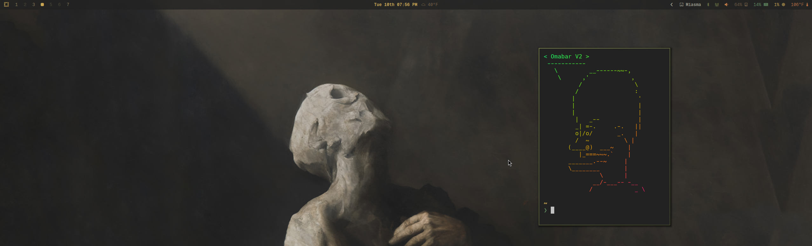

# omabar-v2

A slim, Omarchy-friendly Waybar theme with centered status modules, native MPRIS, and configurable weather with alert awareness.

## Preview



## Install

```bash
bash <(curl -fsSL https://raw.githubusercontent.com/OldJobobo/jobo-bars/master/omabar-v2/install.sh)
```

The installer will show you exactly what it will install and which existing files it will back up, then prompt before touching anything. It also walks you through weather location setup.

To update an existing install (preserves `config.jsonc`, `style.css`, and `weather-location.conf`):

```bash
bash <(curl -fsSL https://raw.githubusercontent.com/OldJobobo/jobo-bars/master/omabar-v2/install.sh) --update
```

Add `--force` to also overwrite those preserved files:

```bash
bash <(curl -fsSL https://raw.githubusercontent.com/OldJobobo/jobo-bars/master/omabar-v2/install.sh) --update --force
```

To uninstall:

```bash
bash <(curl -fsSL https://raw.githubusercontent.com/OldJobobo/jobo-bars/master/omabar-v2/uninstall.sh)
```

The uninstaller reads the install manifest and offers to restore the backup before removing files.

## Requirements

- [OldJobobo custom Omarchy templates](https://github.com/OldJobobo/oldjobobo-custom-omarchy-templates) — provides `omarchy/current/theme/colors.css` used for dynamic palette support

## Suggested

- `ccusage` — improves Claude Code usage reporting by reading live session blocks

  ```bash
  npm install -g ccusage
  ```

  The Claude usage module hides cleanly if Claude Code or usage data are not present.

## Features

- Dynamic palette support via Omarchy's `colors.css`
- Centered clock, weather, update, idle, screen-recording, and media status modules
- Native Waybar `mpris` module with custom playing/paused styling
- Weather powered by Open-Meteo with Weather.gov alert awareness — switches to a pulsing red state when an active advisory is in effect
- Compact layout toggle that persists across restarts
- Claude Code session usage meter with `ccusage` integration
- Codex weekly usage meter (bundled `codex-weekly-left` reads session data from `~/.codex/sessions`)
- Right-click the theme name to load a random Omarchy theme

## Weather Setup

During install you will be prompted to enter a city name and timezone. To reconfigure later, either edit `~/.config/waybar/scripts/weather-location.conf` directly or run the interactive selector (requires `gum`, `jq`, and `fzf`):

```bash
~/.config/waybar/scripts/weather-location-select.sh
```

`weather-location.conf` supports three ways to set your location:

```bash
# Resolved by the Open-Meteo geocoder at first run, then cached
location_query="Seattle, WA"

# Pin exact coordinates to skip geocoding entirely
lat="47.6062"
lon="-122.3321"

# Override the timezone (leave blank to use the system timezone)
tz="America/Los_Angeles"
```

## Files

```
~/.config/waybar/
├── config.jsonc            # Waybar module layout and exec paths
├── style.css               # Theme styling
├── assets/
│   ├── claude-ai.svg       # Claude icon template (recolored to match theme)
│   └── openai-light.svg    # Codex icon template (recolored to match theme)
└── scripts/
    ├── claude-code-status.sh
    ├── clock-status.sh
    ├── codex-weekly-left
    ├── codex-weekly-status.sh
    ├── compact-toggle.sh
    ├── compact-toggle-switch.sh
    ├── temperature-status.sh
    ├── theme-status.sh
    ├── wallpaper-status.sh
    ├── weather-location.conf
    ├── weather-location-select.sh
    └── weather-openmeteo.sh
```
