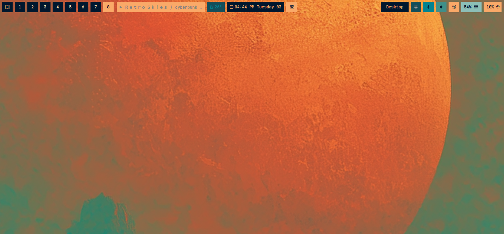

# tilebar-v1

A compact, Omarchy-friendly Waybar theme with a built-in compact toggle mode.

## Preview

## Features

- Dynamic palette support via Omarchy `colors.css`
- Compact toggle module for quick density changes
- Theme-local compact state scripts in `scripts/`

## Files

- `config.jsonc`: Waybar module layout and behavior
- `style.css`: Theme styling
- `scripts/`: Compact mode support scripts and state CSS
- `VERSION`: Theme version
- `CHANGELOG.md`: Release notes
